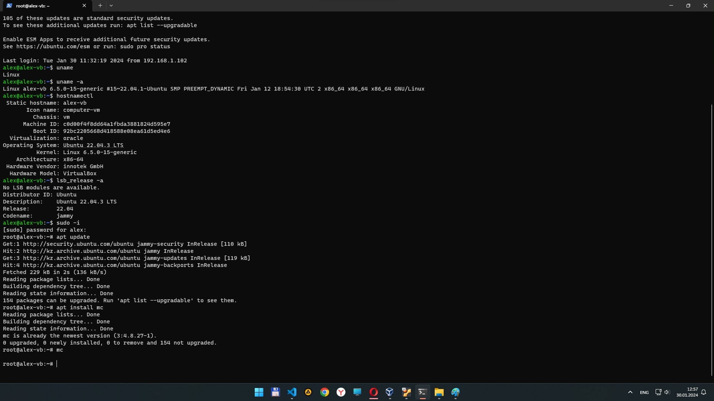
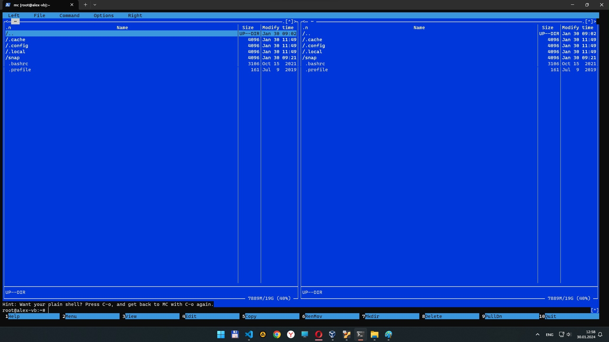

# Homework


```python
# вывести имя ОС
uname

# вывести имя ОС с подробностями
uname -a

# запросить имя хоста (машины)
hostnamectl

# вывести инфо о дистрибутиве
lsb_release -a

# обновить список репозиториев
sudo apt update

# установить пакет mc
sudo apt install mc

# запустить Midnight Commander
mc
```



