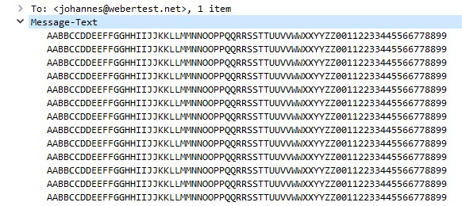

## Урок 5. Основы компьютерных сетей. Транспортный уровень. UDP и TCP.

1. В приложенном файле “The Ultimate PCAP.pcap” (из раздаточного материала) найти e-mail. Что внутри письма и для кого оно?

2. Закрепите навыки фильтрования. Запустите трейс до 8.8.8.8. И перехватите его в Wireshark. Проанализируйте.

3. Закрепите навыки фильтрования. Найдите еще один сайт без шифрования с возможностью ввода логина/пароля. (можно в гугл настроить соответствующую выдачу по запросу с ключом “-inurl:https” в конце). Перехватите их в Wiresharke, построив фильтр.

